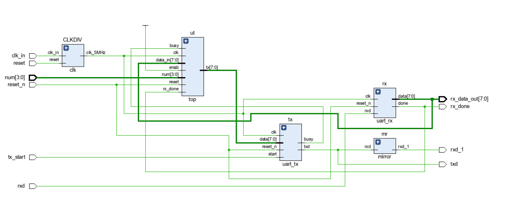
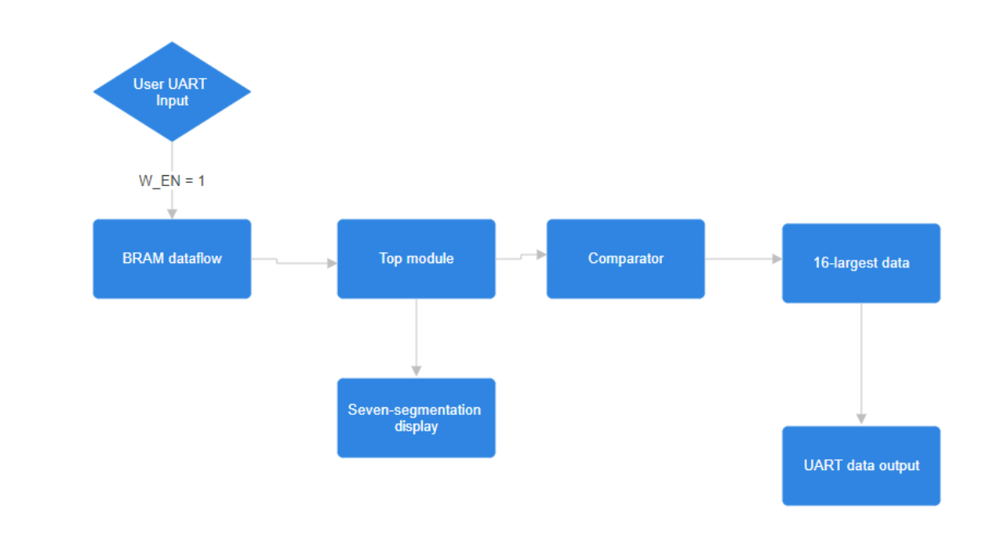
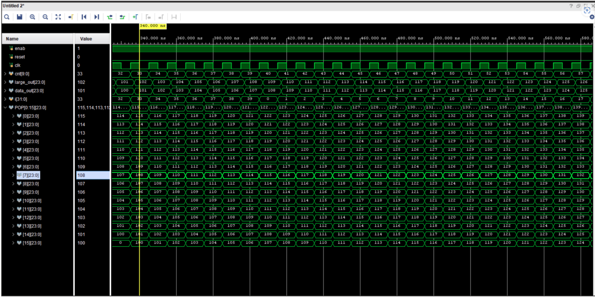
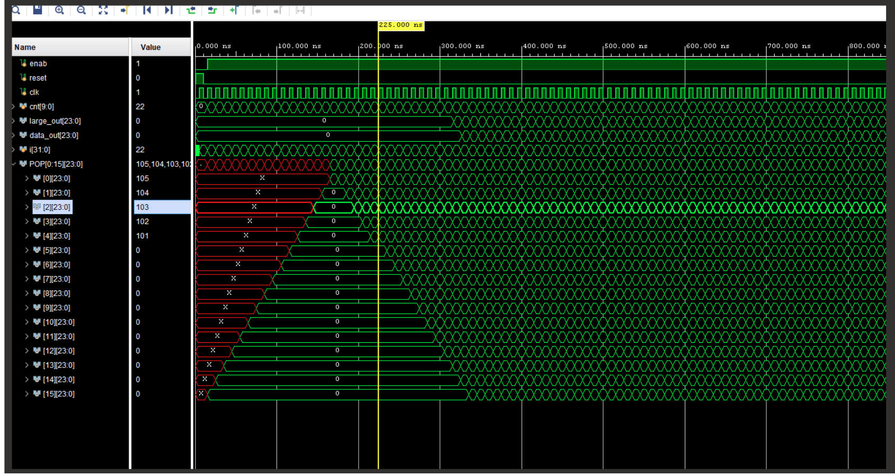

# FPGA-Based-Real-time-sorting-engine
Topic: Real-time sorting engine 

Introduction 

Sorting algorithms play a crucial role in managing and organizing data stored across various massive storage devices, such as hard disks and record-types. Often, only a small fraction of data proves meaningful after offline data processing. Therefore, the ability to perform online data pre-filtering is essential to discard useless data and optimize storage and processing resources. 

Hardware real-time sorting algorithms are particularly well-suited for this task, as they can handle partially scrambled input data streams and produce sorted output data streams at high speed and with low latency. This is a time-consuming process for regular CPUs, which typically require data streams to be spliced into subsequences that fit into internal memory, individually processed, and later combined with successive subsequences. 

By leveraging the parallelism and pipelining capabilities of dedicated hardware components, such as Field Programmable Gate Arrays (FPGAs) or Application-Specific Integrated Circuits (ASICs), hardware real-time sorting algorithms can provide significant performance improvements over traditional software-based sorting algorithms. 

Development Environment, Input and Output 

The Verilog part for hardware design is developed using Vivado2020.2 and python part for UART data transmitter and receiver is using python3.6.2. 

We use BRAM IP catalog in Verilog for data input. In addition to .coe stored data, User input can be import using python through UART to BRAM using BRAM writing port. The 24 bits data contain two part, largest 20 bits represent the data and smallest 4bits data represent the Data ID. We use 8 LEDs to indicate transmit data output and also use python to receive the value through UART. 

Elaborations of the functionalities of core modules 

Our Design contains multiple parts: Sorting part, UART part, Seven-segmentation-display for number of comparators used part.  

Sorting part takes schematic referenced from [1], each comparator with additional enable and comparator’s larger value output to corresponding stack for real-time POP of 16-largest data stored in register. 

UART part is for user data input and data transmit to computer. 

The input of four switches for Seven-segmentation-display is for controlling how many comparators are used, and the number of comparators used is shown on the seven-segmentation display.(0-15) 0 represents the default state which 16 comparators are used. 

Schematic 

 

  

 

This is the connection of comparator and stack, also the seven segmentation display to enable or disable comparator. 

All parts are designed by ourselves. 

Flowchart 

 

  

 

 

Debugging 

We test the module separately.  

For the UART part, we write python file to transmit data and connect UART receiver to transmitter, such that data passed to Basys3 board will flow back and we can see the result. We also use LEDs for visualizing received data. 

For core sorting part. We use behavioral simulation to debug. Input BRAM and user-define value to test both cases. 

For seven segmentation part. We do on board test directly for different user-defined num. 

Simulation 

  

  

  

  

References 

[1] A. A. Colavita, A. Cicuttin, F. Fratnik and G. Capello, "SORTCHIP: a VLSI implementation of a hardware algorithm for continuous data sorting," in IEEE Journal of Solid-State Circuits, vol. 38, no. 6, pp. 1076-1079, June 2003, doi: 10.1109/JSSC.2003.811982. 

 
